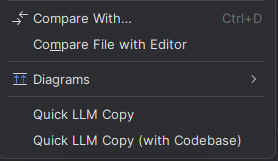

# Quick LLM Copy

<p align="center">
  <a href="https://plugins.jetbrains.com/plugin/27307-quickllmcopy">
    
  </a>
  <a href="https://plugins.jetbrains.com/plugin/27307-quickllmcopy">
    
  </a>
</p>

<p align="center">
  
</p>

Simple IntelliJ IDEA plugin that allows you to copy code files with their relative paths in a format suitable for LLM conversations.

## Features

- Adds "Quick LLM Copy" option to the context menu in the Project View.
- Adds "Quick LLM Copy (with Codebase)" option to include the project directory structure.
- Supports copying multiple files at once.
- Supports recursive copying of directories and their contents.
- Includes relative file paths in the copied text.
- Formats the output in a way that's easy to paste into LLM conversations.
- Handles binary files.
- Settings UI for configuring excluded directories and file extension filtering.

## Usage

1. Right-click on a file, directory, or select multiple files/directories in the IntelliJ IDEA Project View.
2. Choose one of the following options:
   - **Quick LLM Copy**: Copies only the selected files/directories.
   - **Quick LLM Copy (with Codebase)**: Copies the selected files/directories and includes the project directory structure.

### Standard Copy Format

When you use Quick LLM Copy, the output will look like this:

```
Provided code:

File: path/to/file1
// file1 contents

File: path/to/file2
// file2 contents

```

### Copy with Codebase Format

When you use Quick LLM Copy with Codebase, the output will include the project structure:

```
Provided code:

File: path/to/file1
// file1 contents

File: path/to/file2
// file2 contents

You can ask for other files from the codebase if needed:

Project structure:
├── src/
│   ├── main/
│   │   ├── kotlin/
│   │   │   └── com/
│   │   │       └── batyan/
│   │   │           └── QuickLLMCopy/
│   │   │               ├── CopyFilesAction.kt
│   │   │               └── CopyFilesWithCodebaseAction.kt
│   │   └── resources/
│   │       └── META-INF/
│   │           └── plugin.xml
│   └── test/
├── build.gradle.kts
└── settings.gradle.kts
```

## Requirements

- IntelliJ IDEA (refer to `since-build` in `plugin.xml` or `platformVersion` in `build.gradle.kts` for specific version compatibility).

## Extension Settings

The plugin provides the following settings:

* **Excluded Directories**: Configure directories that should be excluded from the codebase view (default: `.idea,.git,.gradle,build,out,node_modules`).
* **File Extension Filtering**: Filter files by their extensions when copying.
* **Prefix Text**: The text that appears before the copied code content (default: "Provided code:").
* **Codebase Text**: The text that appears before the codebase structure (default: "You can ask for other files from the codebase if needed:").

## Known Issues

None at the moment.

## Future Plans

- Add support for custom output formats.
- Add the ability to shorten code by removing comments or other elements.
- Improve performance with large projects.

## Release Notes

See [CHANGELOG.md](CHANGELOG.md) for version history and release notes. 